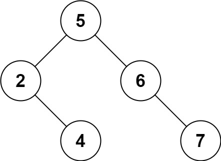

# 450. Delete Node in a BST

🔗 Link: [Delete Node in a BST](https://leetcode.com/problems/delete-node-in-a-bst/description) 
💡 Difficulty: Medium 
🛠️ Topics: Tree, Binary Search Tree, Binary Tree 

## Question

Given a root node reference of a BST and a key, delete the node with the given key in the BST. Return the root node reference (possibly updated) of the BST.

Basically, the deletion can be divided into two stages:

1. Search for a node to remove.
2. If the node is found, delete the node.

### Example 1

Input: root = [5,3,6,2,4,null,7], key = 3
Output: [5,4,6,2,null,null,7]
Explanation: Given key to delete is 3. So we find the node with value 3 and delete it.
One valid answer is [5,4,6,2,null,null,7], shown in the above BST.
Please notice that another valid answer is [5,2,6,null,4,null,7] and it's also accepted.

### Example 2

Input: root = [5,3,6,2,4,null,7], key = 0
Output: [5,3,6,2,4,null,7]
Explanation: The tree does not contain a node with value = 0.

### Example 3

Input: root = [], key = 0
Output: []

### Constraints

* The number of nodes in the tree is in the range `[0, 10^4]`.
* `-10^5 <= Node.val <= 10^5`
* Each node has a **unique** value.
* `root` is a valid binary search tree.
* `-10^5 <= key <= 10^5`

### Follow-up

Could you solve it with time complexity O(height of tree)?

---

## UMPIRE Method

### Understand

> - Ask clarifying questions and use examples to understand what the interviewer wants out of this problem.
> - Choose a “happy path” test input, different than the one provided, and a few edge case inputs. 
> - Verify that you and the interviewer are aligned on the expected inputs and outputs.

### Match
> - See if this problem matches a problem category (e.g. Strings/Arrays) and strategies or patterns within the category

### Plan
> - Sketch visualizations and write pseudocode
> - Walk through a high level implementation with an existing diagram

https://youtu.be/LFzAoJJt92M

As we found the node to be deleted, there are three cases:
1. The node does not have any leaf
    * We simply delete the node by returning a nullptr
2. The node has either one left child or one right child
    * We simply delete the node and return the child
3. The node has two children
    * We find the child with smallest value that is larger than key. I.e., the leftmost leaf on the right subtree. Then substitute its value with the node and delete it

When calling `deleteNode()`, be remember to catch its return value (updating root->right or root->left)

### Implement
> - Implement the solution (make sure to know what level of detail the interviewer wants)

See 450-solution.cpp

### Review
> - Re-check that your algorithm solves the problem by running through important examples
> - Go through it as if you are debugging it, assuming there is a bug

### Evaluate
> - Finish by giving space and run-time complexity
> - Discuss any pros and cons of the solution

#### Time Complexity

`O(logn)`, where `logn` is the height of the tree

#### Space Complexity

Since we have recursive call, the call stack will introduce `O(logn)` space