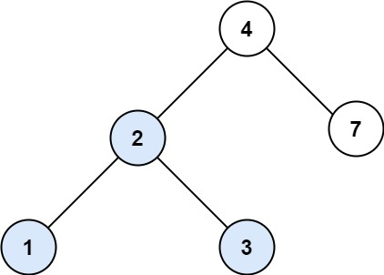

# 700. Search in a Binary Search Tree

🔗 Link: [Search in a Binary Search Tree](https://leetcode.com/problems/search-in-a-binary-search-tree/description/) 
💡 Difficulty: Easy 
🛠️ Topics: Tree, Binary Search Tree, Binary Tree 

## Question

You are given the `root` of a binary search tree (BST) and an integer val.

Find the node in the BST that the node's value equals `val` and return the subtree rooted with that node. If such a node does not exist, return `null`.

### Example 1

Input: root = [4,2,7,1,3], val = 2
Output: [2,1,3]

### Example 2

Input: root = [4,2,7,1,3], val = 5
Output: []

### Constraints

* The number of nodes in the tree is in the range `[1, 5000]`.
* `1 <= Node.val <= 10^7`
* `root` is a binary search tree.
* `1 <= val <= 10^7`

---

## UMPIRE Method

### Understand

> - Ask clarifying questions and use examples to understand what the interviewer wants out of this problem.
> - Choose a “happy path” test input, different than the one provided, and a few edge case inputs. 
> - Verify that you and the interviewer are aligned on the expected inputs and outputs.

### Match
> - See if this problem matches a problem category (e.g. Strings/Arrays) and strategies or patterns within the category

### Plan
> - Sketch visualizations and write pseudocode
> - Walk through a high level implementation with an existing diagram

1. Traverse the tree
    * If val == node->val, return node
    * If val < node->val then traverse the left child tree
    * If val > node->val then traverse the right child tree

### Implement
> - Implement the solution (make sure to know what level of detail the interviewer wants)

See 700-solution.cpp

### Review
> - Re-check that your algorithm solves the problem by running through important examples
> - Go through it as if you are debugging it, assuming there is a bug

### Evaluate
> - Finish by giving space and run-time complexity
> - Discuss any pros and cons of the solution

#### Time Complexity

`O(h)`, where `h` is the height of the tree

#### Space Complexity

Since we have recursive call, the space complexity is `O(h)`, where `h` is the height of the tree for the stack call