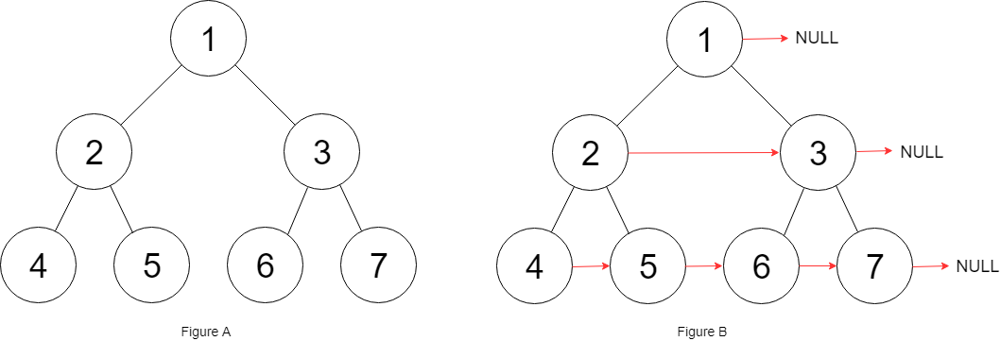

# Populating Next Right Pointers in Each Node

🔗 Link: [Populating Next Right Pointers in Each Node](https://leetcode.com/problems/populating-next-right-pointers-in-each-node/description/) 
💡 Difficulty: Medium 
🛠️ Topics:  

## Question

You are given a perfect binary tree where all leaves are on the same level, and every parent has two children. The binary tree has the following definition:

struct Node {
  int val;
  Node *left;
  Node *right;
  Node *next;
}
Populate each next pointer to point to its next right node. If there is no next right node, the next pointer should be set to `NULL`.

Initially, all next pointers are set to `NULL`.

### Example 1

Input: root = [1,2,3,4,5,6,7]
Output: [1,#,2,3,#,4,5,6,7,#]
Explanation: Given the above perfect binary tree (Figure A), your function should populate each next pointer to point to its next right node, just like in Figure B. The serialized output is in level order as connected by the next pointers, with '#' signifying the end of each level.

### Example 2

Input: root = []
Output: []

### Constraints

* The number of nodes in the tree is in the range `[0, 2^12 - 1]`.
* `-1000 <= Node.val <= 1000`

### Follow-up

* You may only use constant extra space.
* The recursive approach is fine. You may assume implicit stack space does not count as extra space for this problem.

---

## UMPIRE Method

### Understand

> - Ask clarifying questions and use examples to understand what the interviewer wants out of this problem.
> - Choose a “happy path” test input, different than the one provided, and a few edge case inputs. 
> - Verify that you and the interviewer are aligned on the expected inputs and outputs.

### Match
> - See if this problem matches a problem category (e.g. Strings/Arrays) and strategies or patterns within the category

### Plan
> - Sketch visualizations and write pseudocode
> - Walk through a high level implementation with an existing diagram

Use recursion, recursive until the node is `NULL`
1. If a node's parent has `parent->right`, then `node->next` = `parent->right`
2. If a node's parent does NOT have `parent->right`
  * If a node's parenet have `parent->next`, then `node->next` = `parent->next->left`
  * If a node's parenet NOT have `parent->next`, then `node->next` = `NULL`

### Implement
> - Implement the solution (make sure to know what level of detail the interviewer wants)

See 116-solution.cpp

### Review
> - Re-check that your algorithm solves the problem by running through important examples
> - Go through it as if you are debugging it, assuming there is a bug

### Evaluate
> - Finish by giving space and run-time complexity
> - Discuss any pros and cons of the solution

#### Time Complexity

`O(n)`

#### Space Complexity

`O(1)`
