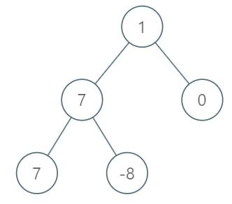

# 1161. Maximum Level Sum of a Binary Tree

🔗 Link: [Maximum Level Sum of a Binary Tree](https://leetcode.com/problems/maximum-level-sum-of-a-binary-tree/description/) 
💡 Difficulty: Medium 
🛠️ Topics: Tree, Depth-First Search, Breadth-First Search, Binary Tree 

## Question

Given the `root` of a binary tree, the level of its root is `1`, the level of its children is `2`, and so on.

Return the smallest level `x` such that the sum of all the values of nodes at level `x` is maximal.

### Example 1

Input: root = [1,7,0,7,-8,null,null]
Output: 2
Explanation: 
Level 1 sum = 1.
Level 2 sum = 7 + 0 = 7.
Level 3 sum = 7 + -8 = -1.
So we return the level with the maximum sum which is level 2.

### Example 2

Input: root = [989,null,10250,98693,-89388,null,null,null,-32127]
Output: 2

### Constraints

* The number of nodes in the tree is in the range `[1, 10^4]`.
* `-10^5 <= Node.val <= 10^5`

---

## UMPIRE Method

### Understand

> - Ask clarifying questions and use examples to understand what the interviewer wants out of this problem.
> - Choose a “happy path” test input, different than the one provided, and a few edge case inputs. 
> - Verify that you and the interviewer are aligned on the expected inputs and outputs.

### Match
> - See if this problem matches a problem category (e.g. Strings/Arrays) and strategies or patterns within the category

### Plan
> - Sketch visualizations and write pseudocode
> - Walk through a high level implementation with an existing diagram

#### Method 1 (DFS)

* Traverse the tree using DFS (pass in the level)
* Maintain a vector to store each level's value sum

#### Method 2 (BFS)

* Traverse the tree using BFS, use an internal for loop to only pop out current level's node and sum their value
* Maintain max_sum and max_index

### Implement
> - Implement the solution (make sure to know what level of detail the interviewer wants)

See 1161-solution-1.cpp, 1161-solution-2.cpp

### Review
> - Re-check that your algorithm solves the problem by running through important examples
> - Go through it as if you are debugging it, assuming there is a bug

### Evaluate
> - Finish by giving space and run-time complexity
> - Discuss any pros and cons of the solution

#### Time Complexity

#### Space Complexity