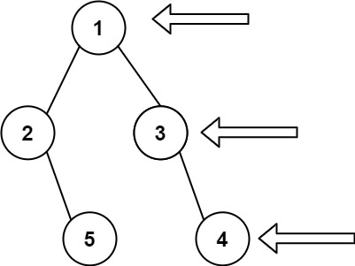

# 199. Binary Tree Right Side View

🔗 Link: [Binary Tree Right Side View](https://leetcode.com/problems/binary-tree-right-side-view/description/) 
💡 Difficulty: Medium 
🛠️ Topics:  

## Question

Given the `root` of a binary tree, imagine yourself standing on the right side of it, return the values of the nodes you can see ordered from top to bottom.

### Example 1

Input: root = [1,2,3,null,5,null,4]
Output: [1,3,4]

### Example 2

Input: root = [1,null,3]
Output: [1,3]

### Example 3

Input: root = []
Output: []

### Constraints

* The number of nodes in the tree is in the range `[0, 100]`.
* `-100 <= Node.val <= 100`

---

## UMPIRE Method

### Understand

> - Ask clarifying questions and use examples to understand what the interviewer wants out of this problem.
> - Choose a “happy path” test input, different than the one provided, and a few edge case inputs. 
> - Verify that you and the interviewer are aligned on the expected inputs and outputs.

### Match
> - See if this problem matches a problem category (e.g. Strings/Arrays) and strategies or patterns within the category

### Plan
> - Sketch visualizations and write pseudocode
> - Walk through a high level implementation with an existing diagram

#### Method I (DFS)

1. Traverse the tree using dfs, and pass an argument to record which level this node is in
    * When traversing, traverse the right child first so we can get the right most one
2. Compare the level of the node and the size of the result (say root node is at level 1)
    * Add the node value to the result only of `result.size == level`

#### Method II (BFS)

1. Use BFS, and use an inner loop to only pop nodes from the same level

### Implement
> - Implement the solution (make sure to know what level of detail the interviewer wants)

See 199-solution-1.cpp, 199-solution-2.cpp

### Review
> - Re-check that your algorithm solves the problem by running through important examples
> - Go through it as if you are debugging it, assuming there is a bug

### Evaluate
> - Finish by giving space and run-time complexity
> - Discuss any pros and cons of the solution

#### Time Complexity

#### Space Complexity