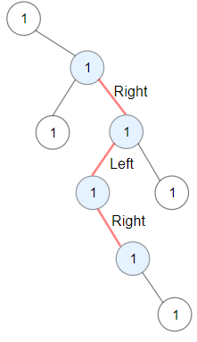

# 1372. Longest ZigZag Path in a Binary Tree

🔗 Link: [Longest ZigZag Path in a Binary Tree](https://leetcode.com/problems/longest-zigzag-path-in-a-binary-tree/description/) 
💡 Difficulty: Medium 
🛠️ Topics: Dynamic Programming, Tree, Depth-First Search, Binary Tree 

## Question

You are given the `root` of a binary tree.

A ZigZag path for a binary tree is defined as follow:

* Choose any node in the binary tree and a direction (right or left).
* If the current direction is right, move to the right child of the current node; otherwise, move to the left child.
* Change the direction from right to left or from left to right.
* Repeat the second and third steps until you can't move in the tree.
* Zigzag length is defined as the number of nodes visited - 1. (A single node has a length of 0).

Return the longest ZigZag path contained in that tree.

### Example 1

Input: root = [1,null,1,1,1,null,null,1,1,null,1,null,null,null,1]
Output: 3
Explanation: Longest ZigZag path in blue nodes (right -> left -> right).

### Example 2

Input: root = [1,1,1,null,1,null,null,1,1,null,1]
Output: 4
Explanation: Longest ZigZag path in blue nodes (left -> right -> left -> right).

### Example 3

Input: root = [1]
Output: 0

### Constraints

* The number of nodes in the tree is in the range `[1, 5 * 10^4]`.
* `1 <= Node.val <= 100`

---

## UMPIRE Method

### Understand

> - Ask clarifying questions and use examples to understand what the interviewer wants out of this problem.
> - Choose a “happy path” test input, different than the one provided, and a few edge case inputs. 
> - Verify that you and the interviewer are aligned on the expected inputs and outputs.

### Match
> - See if this problem matches a problem category (e.g. Strings/Arrays) and strategies or patterns within the category

### Plan
> - Sketch visualizations and write pseudocode
> - Walk through a high level implementation with an existing diagram

1. Use dfs to traverse through the tree
2. Create a helper function `dfs`
    * Have a direction argument to check which direction it should go to
    * Maitain a `length` argument to record how many nodes it has visited
3. Everytime visit a node, we will continue the zigzag and start a new zigzag path from it (set `length = 0`) 

### Implement
> - Implement the solution (make sure to know what level of detail the interviewer wants)

See 1372-solution.cpp

### Review
> - Re-check that your algorithm solves the problem by running through important examples
> - Go through it as if you are debugging it, assuming there is a bug

### Evaluate
> - Finish by giving space and run-time complexity
> - Discuss any pros and cons of the solution

#### Time Complexity

`O(n)`, where `n` is the number of nodes in the tree

#### Space Complexity

The space complexity is determined by the **recursion stack depth**, which is related to the height of the binary tree. In the worst case, the tree could be skewed (e.g., every node only has a left or right child), resulting in a recursion depth equal to the height of the tree, which could be `O(n)` in the worst case.

However, in a balanced binary tree, the height of the tree is `O(log n)`. Hence, in the best case (balanced tree), the recursion stack depth would be `O(log n)`.