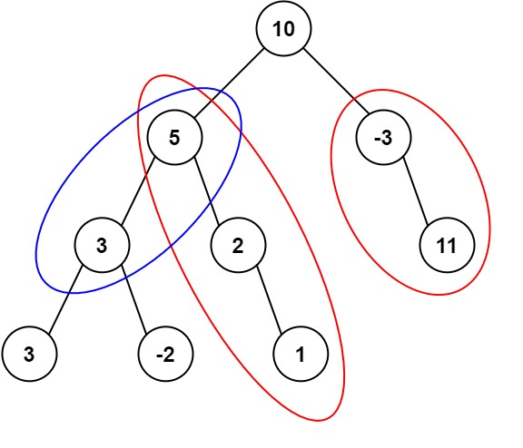

# 437. Path Sum III

🔗 Link: [Path Sum III](https://leetcode.com/problems/path-sum-iii/description/) 
💡 Difficulty: Medium 
🛠️ Topics:  

## Question

Given the `root` of a binary tree and an integer `targetSum`, return the number of paths where the sum of the values along the path equals `targetSum`.

The path does not need to start or end at the root or a leaf, but it must go downwards (i.e., traveling only from parent nodes to child nodes).

### Example 1

Input: root = [10,5,-3,3,2,null,11,3,-2,null,1], targetSum = 8
Output: 3
Explanation: The paths that sum to 8 are shown.

### Example 2

Input: root = [5,4,8,11,null,13,4,7,2,null,null,5,1], targetSum = 22
Output: 3

### Constraints

* The number of nodes in the tree is in the range `[0, 1000]`.
* -10^9 <= Node.val <= 10^9
* -1000 <= targetSum <= 1000

---

## UMPIRE Method

### Understand

> - Ask clarifying questions and use examples to understand what the interviewer wants out of this problem.
> - Choose a “happy path” test input, different than the one provided, and a few edge case inputs. 
> - Verify that you and the interviewer are aligned on the expected inputs and outputs.

1. If the tree is empty, return 0
2. Make sure to use `long long` for `currentSum`

### Match
> - See if this problem matches a problem category (e.g. Strings/Arrays) and strategies or patterns within the category

### Plan
> - Sketch visualizations and write pseudocode
> - Walk through a high level implementation with an existing diagram

#### Method 1 - Recursion

1. Using two steps of DFS
2. For a node, store its value to `currentSum`
  * Check if `currentSum == target`, if yes, `result++`
  * Depth search its child
    * Maintain the `currentSum` and continue adding up (use the `findSum` function)
    * Start DFS from its child, i.e., need to set `currentSum` to 0 (use the `dfs` function)

(solution-1: original, solution-2: updated, cleaner code)

#### Method 2 - DFS + Prefix Sum

1. We maintain an unordered_map to store the prefix sum of path
  * We use a hash map (unordered_map) to keep track of the cumulative sums encountered so far as we traverse the tree. This technique helps efficiently determine the number of valid paths that sum to the target value.
2. Depth-First Search (DFS):
  * Traverse the tree using DFS. For each node, update the current cumulative sum (`currentSum`) by adding the node's value.
  * Check if there is a previously encountered sum that, when subtracted from currentSum, equals the target sum. This tells us how many paths ending at the current node sum to the target.
  * Recursively explore the left and right subtrees while updating and **backtracking** the cumulative sum so that it won't affect other paths.

### Implement
> - Implement the solution (make sure to know what level of detail the interviewer wants)

See 437-solution-1.cpp, 437-solution-2.cpp, 437-solution-3.cpp

### Review
> - Re-check that your algorithm solves the problem by running through important examples
> - Go through it as if you are debugging it, assuming there is a bug

### Evaluate
> - Finish by giving space and run-time complexity
> - Discuss any pros and cons of the solution

#### Time Complexity

1. Method 1: `O(n^2)`
2. Method 2: `O(n)`

#### Space Complexity

1. Method 1: `O(n)`
2. Method 2: `O(n)`
