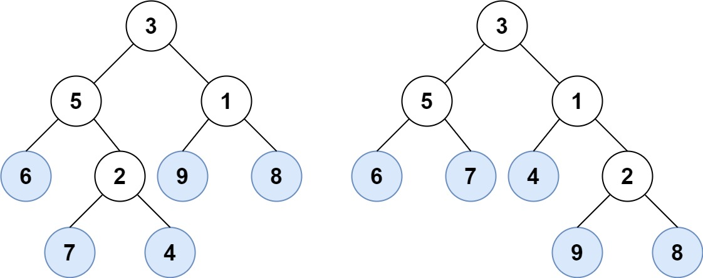

# 872. Leaf-Similar Trees

🔗 Link: [Leaf-Similar Trees](https://leetcode.com/problems/leaf-similar-trees/description/) 
💡 Difficulty: Easy 
🛠️ Topics:  

## Question

Consider all the leaves of a binary tree, from left to right order, the values of those leaves form a leaf value sequence.

For example, in the given tree above, the leaf value sequence is `(6, 7, 4, 9, 8)`.

Two binary trees are considered leaf-similar if their leaf value sequence is the same.

Return `true` if and only if the two given trees with head nodes `root1` and `root2` are leaf-similar.

### Example 1

Input: root1 = [3,5,1,6,2,9,8,null,null,7,4], root2 = [3,5,1,6,7,4,2,null,null,null,null,null,null,9,8]
Output: true

### Example 2

Input: root1 = [1,2,3], root2 = [1,3,2]
Output: false

### Constraints

* The number of nodes in each tree will be in the range `[1, 200]`.
* Both of the given trees will have values in the range `[0, 200]`.

---

## UMPIRE Method

### Understand

> - Ask clarifying questions and use examples to understand what the interviewer wants out of this problem.
> - Choose a “happy path” test input, different than the one provided, and a few edge case inputs. 
> - Verify that you and the interviewer are aligned on the expected inputs and outputs.

### Match
> - See if this problem matches a problem category (e.g. Strings/Arrays) and strategies or patterns within the category

### Plan
> - Sketch visualizations and write pseudocode
> - Walk through a high level implementation with an existing diagram

### Implement
> - Implement the solution (make sure to know what level of detail the interviewer wants)

See xxxx-solution.cpp

### Review
> - Re-check that your algorithm solves the problem by running through important examples
> - Go through it as if you are debugging it, assuming there is a bug

### Evaluate
> - Finish by giving space and run-time complexity
> - Discuss any pros and cons of the solution

#### Time Complexity

#### Space Complexity