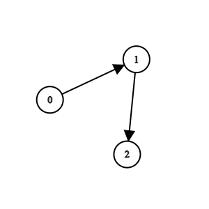
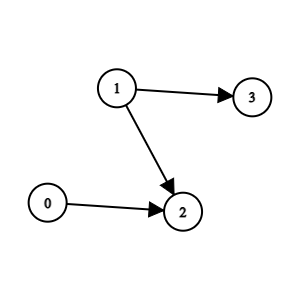

# 2924. Find Champion II

🔗 Link: [Find Champion II](https://leetcode.com/problems/find-champion-ii/description/) 
💡 Difficulty: Medium 
🛠️ Topics: Graph 

## Question

There are `n` teams numbered from `0` to `n - 1` in a tournament; each team is also a node in a DAG.

You are given the integer `n` and a 0-indexed 2D integer array `edges` of length `m` representing the DAG, where `edges[i] = [ui, vi]` indicates that there is a directed edge from team `ui` to team `vi` in the graph.

A directed edge from `a` to `b` in the graph means that team `a` is stronger than team `b` and team `b` is weaker than team `a`.

Team a will be the champion of the tournament if there is no team `b` that is stronger than team `a`.

Return the team that will be the champion of the tournament if there is a unique champion, otherwise, return `-1`.

Notes

* A cycle is a series of nodes `a1, a2, ..., an, an+1` such that node `a1` is the same node as node `an+1`, the nodes `a1, a2, ..., an` are distinct, and there is a directed edge from the node `ai` to node `ai+1` for every `i` in the range `[1, n]`.
* A DAG is a directed graph that does not have any cycle.

### Example 1

Input: n = 3, edges = [[0,1],[1,2]]
Output: 0
Explanation: Team 1 is weaker than team 0. Team 2 is weaker than team 1. So the champion is team 0.

### Example 2

Input: n = 4, edges = [[0,2],[1,3],[1,2]]
Output: -1
Explanation: Team 2 is weaker than team 0 and team 1. Team 3 is weaker than team 1. But team 1 and team 0 are not weaker than any other teams. So the answer is -1.

### Constraints

* `1 <= n <= 100`
* `m == edges.length`
* `0 <= m <= n * (n - 1) / 2`
* `edges[i].length == 2`
* `0 <= edge[i][j] <= n - 1`
* `edges[i][0] != edges[i][1]`
* The input is generated such that if team `a` is stronger than team `b`, team `b` is not stronger than team `a`.
* The input is generated such that if team `a` is stronger than team `b` and team `b` is stronger than team `c`, then team `a` is stronger than team `c`.

---

## UMPIRE Method

### Understand

> - Ask clarifying questions and use examples to understand what the interviewer wants out of this problem.
> - Choose a “happy path” test input, different than the one provided, and a few edge case inputs. 
> - Verify that you and the interviewer are aligned on the expected inputs and outputs.

### Match
> - See if this problem matches a problem category (e.g. Strings/Arrays) and strategies or patterns within the category

### Plan
> - Sketch visualizations and write pseudocode
> - Walk through a high level implementation with an existing diagram

#### Method I

1. From the `edges` array, maintain an adjacency list of all nodes
2. Start from every node, maintain a `visited` array
    * Do DFS from the node
    * After the DFS, check if all nodes are `visited`. If yes, then the node is the champion, else it is not
3. After looping through all nodes, if there is no champion, return -1

#### Method II

1. A champion is a node who does not have any in-edges
2. From the `edges` array, maintain an `in_degree` of all nodes specifying how many in-edges the node have
3. Loop through the nodes
    * If a node's `in_degree` is 0 and there's currently no other node whose `in_degree` is also 0, update the `result` to be that node
    * If a node's `in_degree` is 0 and there's already other node whose `in_degree` is also 0, return -1
4. Return result

### Implement
> - Implement the solution (make sure to know what level of detail the interviewer wants)

See 2924-solution-1.cpp, 2924-solution-2.cpp

### Review
> - Re-check that your algorithm solves the problem by running through important examples
> - Go through it as if you are debugging it, assuming there is a bug

### Evaluate
> - Finish by giving space and run-time complexity
> - Discuss any pros and cons of the solution

#### Time Complexity

#### Method I

* Constructing the adjacency list: `O(m)`
* For each node, performing DFS: `n * O(n + m)`
* Checking the visited array for all nodes: `n * O(n)`

Worst case: `O(n^3)`

#### Method II

`O(m)`

#### Space Complexity

#### Method I

`O(n+m)` for the `adjacency_list`
`n * O(n)` for the `visted`
`n * O(n)` for recursion stack

#### Method II

`O(n)` for `in_degree`