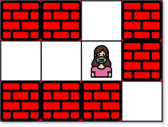
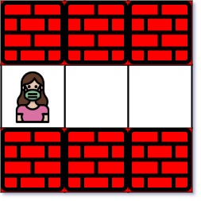

# 1926. Nearest Exit from Entrance in Maze

🔗 Link: [Nearest Exit from Entrance in Maze](https://leetcode.com/problems/nearest-exit-from-entrance-in-maze/description/) 
💡 Difficulty: Medium 
🛠️ Topics: Array, Breadth-First Search, Matrix 

## Question

You are given an `m x n` matrix `maze` (0-indexed) with empty cells (represented as `'.'`) and walls (represented as `'+'`). You are also given the `entrance` of the maze, where `entrance = [entrance_row, entrance_col]` denotes the row and column of the cell you are initially standing at.

In one step, you can move one cell up, down, left, or right. You cannot step into a cell with a wall, and you cannot step outside the maze. Your goal is to find the nearest exit from the `entrance`. An exit is defined as an empty cell that is at the border of the maze. The entrance does not count as an exit.

Return the number of steps in the shortest path from the `entrance` to the nearest exit, or `-1` if no such path exists.

### Example 1

Input: maze = [["+","+",".","+"],[".",".",".","+"],["+","+","+","."]], entrance = [1,2]
Output: 1
Explanation: There are 3 exits in this maze at [1,0], [0,2], and [2,3].
Initially, you are at the entrance cell [1,2].
- You can reach [1,0] by moving 2 steps left.
- You can reach [0,2] by moving 1 step up.
It is impossible to reach [2,3] from the entrance.
Thus, the nearest exit is [0,2], which is 1 step away.

### Example 2

Input: maze = [["+","+","+"],[".",".","."],["+","+","+"]], entrance = [1,0]
Output: 2
Explanation: There is 1 exit in this maze at [1,2].
[1,0] does not count as an exit since it is the entrance cell.
Initially, you are at the entrance cell [1,0].
- You can reach [1,2] by moving 2 steps right.
Thus, the nearest exit is [1,2], which is 2 steps away.

### Example 3

Input: maze = [[".","+"]], entrance = [0,0]
Output: -1
Explanation: There are no exits in this maze.

### Constraints

* `maze.length == m`
* `maze[i].length == n`
* `1 <= m, n <= 100`
* `maze[i][j]` is either `'.'` or `'+'`.
* `entrance.length == 2`
* `0 <= entrance_row < m`
* `0 <= entrance_col < n`
* `entrance` will always be an empty cell.

---

## UMPIRE Method

### Understand

> - Ask clarifying questions and use examples to understand what the interviewer wants out of this problem.
> - Choose a “happy path” test input, different than the one provided, and a few edge case inputs. 
> - Verify that you and the interviewer are aligned on the expected inputs and outputs.

### Match
> - See if this problem matches a problem category (e.g. Strings/Arrays) and strategies or patterns within the category

### Plan
> - Sketch visualizations and write pseudocode
> - Walk through a high level implementation with an existing diagram

1. Since we want to find the nearest exit, we can do BFS from the entrance and record the steps from the entrance, as soon as we encounter an exit, return the steps
2. Convert every node that is push into the `bfs` queue to be '+' to mark it visited

### Implement
> - Implement the solution (make sure to know what level of detail the interviewer wants)

See 1926-solution.cpp

### Review
> - Re-check that your algorithm solves the problem by running through important examples
> - Go through it as if you are debugging it, assuming there is a bug

### Evaluate
> - Finish by giving space and run-time complexity
> - Discuss any pros and cons of the solution

#### Time Complexity

The time complexity of this BFS algorithm is `O(m*n)` since BFS visits each cell at most once
* `m` is the number of rows in the maze.
* `n` is the number of columns in the maze.

#### Space Complexity

`O(m*n)` for the queue