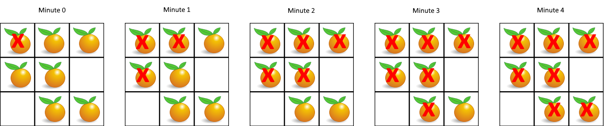

# 994. Rotting Oranges

🔗 Link: [Rotting Oranges](https://leetcode.com/problems/rotting-oranges/description/) 
💡 Difficulty: Medium 
🛠️ Topics: Array, Breadth-First Search, Matrix 

## Question

You are given an `m x n` `grid` where each cell can have one of three values:

* `0` representing an empty cell,
* `1` representing a fresh orange, or
* `2` representing a rotten orange.
Every minute, any fresh orange that is 4-directionally adjacent to a rotten orange becomes rotten.

Return the minimum number of minutes that must elapse until no cell has a fresh orange. If this is impossible, return `-1`.

### Example 1

Input: grid = [[2,1,1],[1,1,0],[0,1,1]]
Output: 4

### Example 2

Input: grid = [[2,1,1],[0,1,1],[1,0,1]]
Output: -1
Explanation: The orange in the bottom left corner (row 2, column 0) is never rotten, because rotting only happens 4-directionally.

### Example 3

Input: grid = [[0,2]]
Output: 0
Explanation: Since there are already no fresh oranges at minute 0, the answer is just 0.

### Constraints

* `m == grid.length`
* `n == grid[i].length`
* `1 <= m, n <= 10`
* `grid[i][j]` is `0`, `1`, or `2`.

---

## UMPIRE Method

### Understand

> - Ask clarifying questions and use examples to understand what the interviewer wants out of this problem.
> - Choose a “happy path” test input, different than the one provided, and a few edge case inputs. 
> - Verify that you and the interviewer are aligned on the expected inputs and outputs.

### Match
> - See if this problem matches a problem category (e.g. Strings/Arrays) and strategies or patterns within the category

### Plan
> - Sketch visualizations and write pseudocode
> - Walk through a high level implementation with an existing diagram

#### Method 1

1. Use another vector<vector<int>> new_grid to record next state grid
2. Traverse through each cell **until no fresh orange change to rotten**, during each traverse:
    * For each rotten orange, change its neighbor to rotten in the new_grid
    * Record time and how many oranges become rotten
    * In the end, make grid = new_grid
3. Check if there are still fresh orange in the grid, if yes, return -1, else return time

#### Method 2

1. Traverse through the `grid` once to record how many fresh oranges are there and push the rotten ones into a priority_queue `bfs`
2. Run bfs level by level and record the time, once we convert one fresh orange to rotten
    * Add that orange to queue
    * **Edge case**: bfs queue is not empty but there is no more fresh organge, this will increase the time by 1 → need to check this for bfs condition
    * `freshOrange` -= 1
3. In the end, check if `freshOrange` is 0. If not, return -1, else return time

### Implement
> - Implement the solution (make sure to know what level of detail the interviewer wants)

See 994-solution-1.cpp, 994-solution-2.cpp

### Review
> - Re-check that your algorithm solves the problem by running through important examples
> - Go through it as if you are debugging it, assuming there is a bug

### Evaluate
> - Finish by giving space and run-time complexity
> - Discuss any pros and cons of the solution

#### Time Complexity

#### Space Complexity