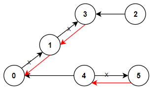
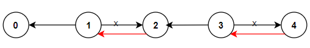

# 1466. Reorder Routes to Make All Paths Lead to the City Zero

🔗 Link: [Reorder Routes to Make All Paths Lead to the City Zero](https://leetcode.com/problems/reorder-routes-to-make-all-paths-lead-to-the-city-zero/description/) 
💡 Difficulty: Medium 
🛠️ Topics: Depth-First Search, Breadth-First Search, Graph 

## Question

There are `n` cities numbered from `0` to `n - 1` and `n - 1` roads such that there is only one way to travel between two different cities (this network form a tree). Last year, The ministry of transport decided to orient the roads in one direction because they are too narrow.

Roads are represented by `connections` where `connections[i] = [ai, bi]` represents a road from city `ai` to city `bi`.

This year, there will be a big event in the capital (city `0`), and many people want to travel to this city.

Your task consists of reorienting some roads such that each city can visit the city `0`. Return the minimum number of edges changed.

It's guaranteed that each city can reach city `0` after reorder.

### Example 1

Input: n = 6, connections = [[0,1],[1,3],[2,3],[4,0],[4,5]]
Output: 3
Explanation: Change the direction of edges show in red such that each node can reach the node 0 (capital).

### Example 2

Input: n = 5, connections = [[1,0],[1,2],[3,2],[3,4]]
Output: 2
Explanation: Change the direction of edges show in red such that each node can reach the node 0 (capital).

### Example 3

Input: n = 3, connections = [[1,0],[2,0]]
Output: 0

### Constraints

* `2 <= n <= 5 * 10^4`
* `connections.length == n - 1`
* `connections[i].length == 2`
* `0 <= ai, bi <= n - 1`
* `ai != bi`

---

## UMPIRE Method

### Understand

> - Ask clarifying questions and use examples to understand what the interviewer wants out of this problem.
> - Choose a “happy path” test input, different than the one provided, and a few edge case inputs. 
> - Verify that you and the interviewer are aligned on the expected inputs and outputs.

### Match
> - See if this problem matches a problem category (e.g. Strings/Arrays) and strategies or patterns within the category

### Plan
> - Sketch visualizations and write pseudocode
> - Walk through a high level implementation with an existing diagram

1. Treat the graph as **undirected** graph (maintain a adjacency list)
    * Yet for a reversed path, mark the ending node negative so that we can track that this is a back edge
2. Do DFS from node 0, when we encounter a path that is not incoming for node 0 (i.e., the ending node in the adjacency list is positive), we add the result by one

### Implement
> - Implement the solution (make sure to know what level of detail the interviewer wants)

See 1466-solution.cpp

### Review
> - Re-check that your algorithm solves the problem by running through important examples
> - Go through it as if you are debugging it, assuming there is a bug

### Evaluate
> - Finish by giving space and run-time complexity
> - Discuss any pros and cons of the solution

#### Time Complexity

`O(n)`, where `n` is the number of node

#### Space Complexity

`O(n)`
* Adjacency list: `O(n)`
* Visited vector: `O(n)`
* Call stack for DFS: the depth of the recursive DFS calls can go up to `n` in the worst case (if the graph is a chain), so the maximum space used by the call stack is `O(n)`